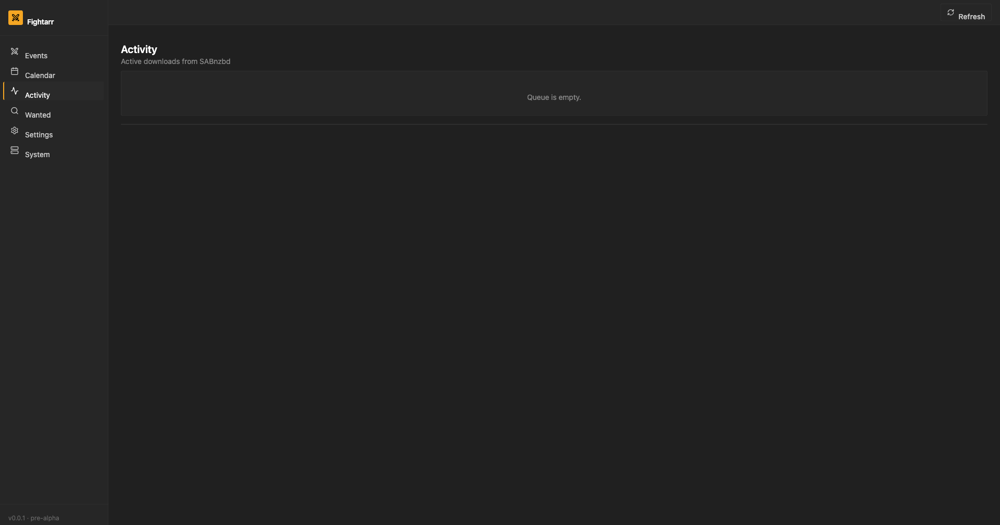

<div align="center">


# Fightarr

**UFC event manager for Usenet and Plex**

[](LICENSE)
[](https://python.org)
[](https://fastapi.tiangolo.com)
[](https://react.dev)
[](#status)
[](#-vibe-coded--read-this-before-you-deploy)

Radarr [explicitly won't support UFC](https://github.com/Radarr/Radarr/issues/9215). Fightarr does.

</div>

---

## ⚠️ Vibe-coded — read this before you deploy

Fightarr is **vibe-coded**: a human owner directing an AI coding assistant in conversational, iterative passes rather than a traditional spec → design → review → implement workflow. The features are real, the tests pass, the production build is clean — but you should treat the codebase the same way you'd treat any unaudited OSS app you found on GitHub last week.

**Specifically:**

- **No security audit yet.** Don't expose this to the public internet without a reverse proxy + auth in front of it. There is no built-in authentication. Run it on your LAN or behind a VPN/Tailscale/Cloudflare Tunnel.
- **Stores secrets in SQLite.** API keys (indexer, Plex, Jellyfin, Discord webhooks) and download-client passwords live in `fightarr.db`. They are *not* encrypted at rest — protect that file the same way you'd protect a `.env` with the same secrets.
- **Talks to your indexers and download clients on your behalf.** Misconfigured priority ordering or quality scoring could grab releases you didn't want. Start with monitor-by-default *off* (it is) and grab a few events manually before turning on bulk auto-search.
- **Schema migrations are best-effort additive.** New columns are auto-added on startup, but column type changes or destructive renames will require a manual `sqlite3` step. Back up `fightarr.db` before pulling a new version.
- **The disk side-effects are real.** The importer hardlinks/copies files into your media root, downloads `poster.jpg` into each event folder, and triggers Plex/Jellyfin library scans. Test against a scratch directory first.
- **Production-ready means "the happy path works end-to-end."** It does not mean every error case has been thought through. File a GitHub issue when you find one.

If you'd rather wait for a human-reviewed v1.0.0 cut, watch the repo and check back when there's a versioned tag without `pre-alpha` on it.

---

## The problem

UFC release names look like `UFC.300.Pereira.vs.Hill.1080p.WEB-DL.H264`. There is no `(YYYY)`. The event is not in TMDB. Radarr's parser requires both. The Radarr team closed the feature request as **Won't Fix** and the community has been duct-taping workarounds for years — manually adding each card as a fake movie, manually matching releases, manually renaming files.

Fightarr is a purpose-built sibling to Radarr that solves this correctly. It speaks directly to your Newznab indexers and SABnzbd, understands UFC event naming natively, and organizes your library the way Plex expects — without any of the Radarr-shaped hacks.

---

## Screenshots

> The screenshots below are from earlier builds. The UI has since gained Radarr-style left-sidebar Settings tabs, a top-tab System page (Status / Tasks / Health / Logs), inline priority arrows on indexers and download clients, a Blocklist tab in Activity, sidebar count badges, toast notifications, and Discord webhook notifications. Fresh captures will land in a future commit.

<table>
<tr>
<td><b>Events</b> — every event tracked across the full schedule, scraped live from Wikipedia, monitor toggle per card</td>
</tr>
<tr>
<td></td>
</tr>
<tr>
<td><b>Calendar</b> — upcoming events grouped by date with venue details</td>
</tr>
<tr>
<td></td>
</tr>
<tr>
<td><b>Wanted</b> — monitored events with no file, "Search All" + per-event "Auto-Grab" buttons</td>
</tr>
<tr>
<td></td>
</tr>
<tr>
<td><b>Activity</b> — Queue / History / Blocklist tabs with live progress, sortable columns, and inline error messages</td>
</tr>
<tr>
<td></td>
</tr>
<tr>
<td><b>Settings</b> — Radarr-style left-sidebar tabs: Media Management, Indexers, Download Clients, Connect, Metadata. Inline priority arrows on indexer/client rows.</td>
</tr>
<tr>
<td></td>
</tr>
</table>

---

## What it does

| Feature | Status |
|---|---|
| Scrapes UFC schedule from Wikipedia (PPVs, Fight Nights, On ABC) | ✅ Working |
| Historical year sync (any year from 2001) + future year pre-load | ✅ Working |
| Cover art — Wikipedia REST API, zero config, no API key needed | ✅ Working |
| Newznab / Torznab indexer support + connection test | ✅ Working |
| Calendar view — next 30 days, grouped by date | ✅ Working |
| Wanted list — monitored events with no file | ✅ Working |
| Indexer CRUD + test button via Settings UI | ✅ Working |
| Download clients — SABnzbd, NZBGet, qBittorrent, Deluge, Transmission, Real-Debrid | ✅ Working |
| Download client CRUD + connection test via Settings UI | ✅ Working |
| Post-processing renamer — Radarr-style Plex folder/file naming | ✅ Working |
| Hardlink-first library import (copy fallback) | ✅ Working |
| Plex + Jellyfin library refresh notify | ✅ Working |
| Activity queue — live progress bars, status badges, auto-refresh | ✅ Working |
| History page — imported/failed downloads with file paths | ✅ Working |
| Live DB schema migrations on startup (no Alembic required) | ✅ Working |
| Event detail page — poster, metadata, history, interactive search | ✅ Working |
| Query builder — PPV by number, Fight Night by sequential number + date fallback, fighter surnames | ✅ Working |
| Interactive search — quality profiles (WEBDL-1080p), Prelims badge, sorted results | ✅ Working |
| Search diagnostics — indexer errors and queries tried shown in UI | ✅ Working |
| Monitor/unmonitor toggle — per-event and bulk unmonitor all | ✅ Working |
| Release scorer — resolution, codec, size, prelims filter | 🔧 In progress |
| Quality profiles UI (cutoff model) | 📋 Planned |
| Discord / Apprise notifications | 📋 Planned |
| Single-container Docker image for Unraid | 📋 Planned |
| Unraid Community Applications template | 📋 Planned |

Full roadmap: [docs/ROADMAP.md](docs/ROADMAP.md)

---

## Quickstart

### Docker (recommended — single container)

```bash
docker run -d \
  --name fightarr \
  -p 7878:7878 \
  -v /your/config:/config \
  -v /your/ufc/media:/media \
  ghcr.io/btoth525/fightarr:latest
```

| URL | Purpose |
|---|---|
| http://localhost:7878 | Web UI |
| http://localhost:7878/api/v1 | REST API |
| http://localhost:7878/docs | Swagger |

> Port 7878 matches Radarr's default — no muscle-memory retraining required.

### Docker Compose (dev)

```bash
git clone https://github.com/btoth525/Fightarr
cd Fightarr
docker compose up --build
```

### Manual (development)

**Backend**
```bash
cd backend
pip install -r requirements.txt
uvicorn app.main:app --reload --port 7878
```

**Frontend**
```bash
cd frontend
npm install
npm run dev
```

---

## Library output (Plex-ready)

When a download completes, Fightarr renames and organizes files exactly the way Plex expects:

```
{media_root}/
├── UFC 300 - Pereira vs. Hill (2024)/
│   ├── UFC 300 - Pereira vs. Hill (2024) WEBDL-1080p.mkv
│   └── poster.jpg
├── UFC Fight Night - Strickland vs. Hernandez (2026)/
│   ├── UFC Fight Night - Strickland vs. Hernandez (2026) WEBDL-1080p.mkv
│   └── poster.jpg
└── ...
```

- **Folder format**: `{Title} ({Year})` — Radarr-compatible, Plex Movie agent picks it up automatically
- **Filename format**: `{Folder} {Quality}.{ext}` with full quality profile (`WEBDL-1080p`, `Bluray-2160p`, `WEBRip-720p`, `HDTV-720p`)
- **Poster art**: `poster.jpg` is downloaded into each event folder — Plex's Local Media Assets agent uses it as the cover even without a TMDB match
- **Hardlinks-first**: imports use `os.link()` so the original NZB stays seedable; falls back to copy across filesystems
- **Sample skipping**: anything under 100 MB or with "sample" in the name is ignored

### SAB / NZBGet category setup

Fightarr sends every download with a `cat=` param (default: `ufc`). Configure your downloader to put that category somewhere Fightarr can read:

**SABnzbd**: Settings → Categories → Add a category named `ufc`. Set the folder to whatever incomplete/complete path you use (e.g. `/downloads/ufc`). That's it — Fightarr's queue monitor watches SAB history, finds the largest video file, renames it, and moves it into your media root.

**NZBGet**: Settings → Categories → Add `ufc` with a destination dir. Same flow as SAB.

You don't need post-processing scripts. Fightarr handles renaming, poster art, and Plex/Jellyfin notification on its own — same model as Radarr.

---

## Architecture

```
┌──────────────┐   ┌────────────────────┐   ┌──────────┐   ┌──────┐
│  Wikipedia   │   │  Newznab indexers  │   │ SABnzbd  │   │ Plex │
│  (schedule)  │   │  (your provider)   │   │          │   │      │
└──────┬───────┘   └─────────┬──────────┘   └────┬─────┘   └──┬───┘
       │                     │                   ▲             ▲
       ▼                     ▼                   │             │
┌──────────────────────────────────────────────────────────────────┐
│                           Fightarr                               │
│                                                                  │
│  Scrapers → Event DB → Query builder → Newznab search            │
│                              ↓                                   │
│                        Release scorer → SABnzbd API              │
│                                              ↓                   │
│                                     Post-process renamer         │
└──────────────────────────────────────────────────────────────────┘
```

**Stack**

| Layer | Tech |
|---|---|
| Backend | Python 3.11, FastAPI, SQLAlchemy 2.0 (async), SQLite, APScheduler |
| Frontend | React 18, TypeScript, Vite, Tailwind CSS, TanStack Query |
| Scraping | httpx, BeautifulSoup4, lxml |
| Indexer client | Newznab (lxml XML parser) |
| Download client | SABnzbd HTTP API |
| Container | Docker Compose (dev), single multi-stage image (prod/Unraid) |

---

## Unraid

Fightarr is built to live in your Unraid tower alongside Radarr, Sonarr, and SABnzbd. The single most important thing to get right is **path mapping**: Fightarr can only import a completed download if it can read the folder SAB writes to.

The cleanest solution (and what Radarr/Sonarr's [TRaSH-Guides](https://trash-guides.info/Hardlinks/How-to-setup-for/Unraid/) recommend) is one unified `/data` mount across every container:

```yaml
# Fightarr (this template)
/mnt/user/appdata/fightarr   →   /config   (SQLite database, never share)
/mnt/user/data               →   /data     (downloads + media, single mount)

# SABnzbd (must use the SAME host path)
/mnt/user/data               →   /data
  → SAB category "ufc" folder = /data/usenet/complete/ufc

# Plex / Jellyfin (must use the SAME host path)
/mnt/user/data               →   /data
  → Library = /data/media/ufc
```

With this layout:
- SAB drops a finished download in `/data/usenet/complete/ufc/UFC.300.../` — Fightarr sees that exact path
- Fightarr hardlinks the file into `/data/media/ufc/UFC 300 - Pereira vs Hill (2024)/` — Plex sees that exact path
- **Hardlinks work** because both folders live on the same filesystem, so the move costs zero extra disk space and your NZB stays seedable

Then in Fightarr Settings → Media Management, set **Root Folder** to `/data/media/ufc`.

### If your paths are already different

If Radarr or Sonarr already work for you with `/downloads` and `/media` mounts, you can use the same layout — Fightarr's Unraid template has optional legacy fields for it.

If your download client is on a different machine (or in a container that can't share `/data`), add a **Remote Path Mapping** in Fightarr Settings → Download Clients → Remote Path Mappings:

```
Remote (SAB sees):   /downloads/complete/ufc
Local (Fightarr):    /data/usenet/complete/ufc
```

Fightarr will translate the path returned by SAB into one it can actually read before importing. Same feature as Radarr's, same UI position.

### Container settings

Pull from GHCR — multi-arch (`linux/amd64` + `linux/arm64`):

```bash
docker pull ghcr.io/btoth525/fightarr:latest
```

Default port is `7878` (matches Radarr) but the Unraid template defaults to `7879` so it doesn't collide if you're running both. Run-as user defaults to `99:100` (`nobody:users`) and `UMASK=002` to match Radarr/Sonarr file permissions.

The Unraid template lives at [`docs/unraid-template.xml`](docs/unraid-template.xml) and a Community Applications submission will follow once the project has a versioned tag without `pre-alpha` on it.

---

## Docker image

Production images are published to GitHub Container Registry:

```bash
docker pull ghcr.io/btoth525/fightarr:latest
```

Multi-arch: `linux/amd64` and `linux/arm64` (covers Unraid on both Intel/AMD and ARM boards).

Tags follow `v0.x.y` semver. `:latest` always points to the most recent release.

---

## Contributing

Open-source from day one. PRs welcome.

- Read [CONTRIBUTING.md](CONTRIBUTING.md) for the ground rules
- Read [docs/ARCHITECTURE.md](docs/ARCHITECTURE.md) for the design decisions
- The [Radarr issue](https://github.com/Radarr/Radarr/issues/9215) is the canonical "why this exists" document

**Good first issues to pick up:**
- Query builder — given an `Event`, generate UFC-specific Newznab search strings
- Release scorer — rank results by resolution, codec, size, and user preferences
- SABnzbd client — fill in the `add_url` and `queue_status` stubs

```bash
# Run tests
cd backend && pytest -v

# Lint
ruff check . && black --check .
```

---

## License

[GPL-3.0](LICENSE) — same as Radarr, Sonarr, Lidarr, and the rest of the ecosystem. The *arr norms apply here too.
